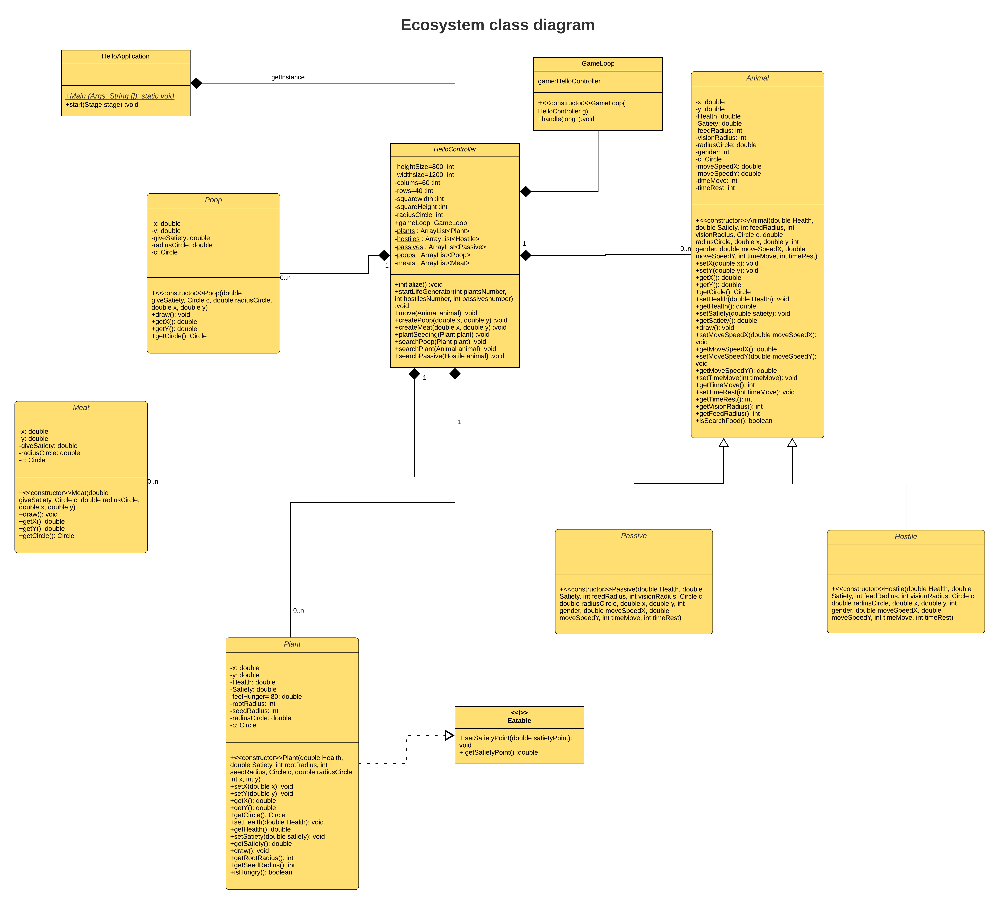

# EcosystemJava
Ecosystem's simulation using javafx
Created by Maillard Corentin n°21306
# Framework
To launch it you have to start HelloApplication

## Entities in the simulation
1) The red circle are the hostile mob (carnivorous)
2) The blue circle are the passive mob (herbivorous)
3) The green circle are the plant
4) The brown circle are poop
5) The purple circle are meat

# Class diagram

# Sequence diagram
# SOLID principles
## Liskov substitution principle
### Let q(x) be a property provable about objects of x of type T. Then q(y) should be provable for objects y of type S where S is a subtype of T.

Here we can replace animal by a subclass of it (hostile, passive,...) and the methods use will still work.

    public void move(Animal animal){
        int timeM = animal.getTimeMove();
        int timeR = animal.getTimeRest();
        int rnd = (int)(Math.random()*10);
        if(animal.getMoveSpeedX()!=0 || animal.getMoveSpeedY()!=0){ //check if animal is moving
            if(animal.getX()>(double)(widthSize-radiusCircle/2) || animal.getX()<(double)(radiusCircle/2)){
                animal.setMoveSpeedX(-animal.getMoveSpeedX());
            }
            if(animal.getY()>(double)(heightSize-radiusCircle/2) || animal.getY()<(double)(radiusCircle/2)){
                animal.setMoveSpeedY(-animal.getMoveSpeedY());
            }
            animal.setX(animal.getX()+animal.getMoveSpeedX());
            animal.setY(animal.getY()+animal.getMoveSpeedY());
            animal.draw();
            animal.setTimeMove(timeM);
            if(animal.getTimeMove()==0){
                animal.setMoveSpeedX(0);
                animal.setMoveSpeedY(0);
                animal.setTimeRest((int)(Math.random() * 500));
            }
        }
        if(timeR>0 && animal.getMoveSpeedX()==0 && animal.getMoveSpeedY()==0){ //check if animal is resting
            animal.setTimeRest(timeR);
            if(animal.getTimeRest()==0){
                if(rnd <= 5){
                    animal.setMoveSpeedX(-Math.random());
                    animal.setMoveSpeedY(-Math.random());
                }
                else{
                    animal.setMoveSpeedX(Math.random());
                    animal.setMoveSpeedY(Math.random());
                }
                createPoop(animal.getX(), animal.getY());
                animal.setSatiety(animal.getSatiety()-5); //remove satiety each time a poop is created
                animal.setTimeMove((int)(Math.random() * 200));

            }
        }
    }
 
## Single responsibility principle
### A class should have one and only one reason to change, meaning that a class should only have one job.

Here, the only role of the Animal class is to define the characteristics of the animal and to manage the changes of characteristics.

 public class Animal{
    private double x;
    private double y;
    private double Health;
    private double Satiety;
    private int feedRadius;
    private int visionRadius;
    private double radiusCircle;
    private int gender; // 0 is a female and 1 a male
    private Circle c;
    private double moveSpeedX;
    private double moveSpeedY;
    private int timeMove;
    private int timeRest;

    public Animal(double Health, double Satiety, int feedRadius, int visionRadius, Circle c, double radiusCircle, double x, double y, int gender, double moveSpeedX, double moveSpeedY, int timeMove, int timeRest){
        this.Health=Health;
        this.Satiety=Satiety;
        this.feedRadius=feedRadius;
        this.visionRadius=visionRadius;
        this.c=c;
        this.radiusCircle=radiusCircle;
        this.x=x;
        this.y=y;
        this.gender=gender;
        this.moveSpeedX=moveSpeedX;
        this.moveSpeedY=moveSpeedY;
        this.timeMove=timeMove;
        this.timeRest=timeRest;
    }
    public void setX(double x) {
        this.x=x;
    }

    public void setY(double y) {
        this.y=y;
    }

    public double getX() {
        return x;
    }

    public double getY() {
        return y;
    }

    public Circle getCircle(){ return c;}

    public void setHealth(double Health){
        this.Health=Health;
    }

    public double getHealth() {
        return Health;
    }

    public void setSatiety(double satiety) {
        this.Satiety = satiety;
    }

    public double getSatiety() {
        return Satiety;
    }

    public void draw(){
        c.setRadius(radiusCircle);
        c.setTranslateX(x);
        c.setTranslateY(y);
    }

    public void setMoveSpeedX(double moveSpeedX) {
        this.moveSpeedX = moveSpeedX;
    }

    public double getMoveSpeedX() {
        return moveSpeedX;
    }

    public void setMoveSpeedY(double moveSpeedY) {
        this.moveSpeedY = moveSpeedY;
    }

    public double getMoveSpeedY() {
        return moveSpeedY;
    }

    public void setTimeMove(int timeMove){this.timeMove = timeMove-1; }

    public int getTimeMove(){ return timeMove; }

    public void setTimeRest(int timeRest){ this.timeRest = timeRest -1; }

    public int getTimeRest(){ return timeRest; }

    public int getVisionRadius(){return visionRadius;}

    public int getFeedRadius(){return feedRadius;}

    public boolean isSearchFood(){return (Satiety<60);}

}
